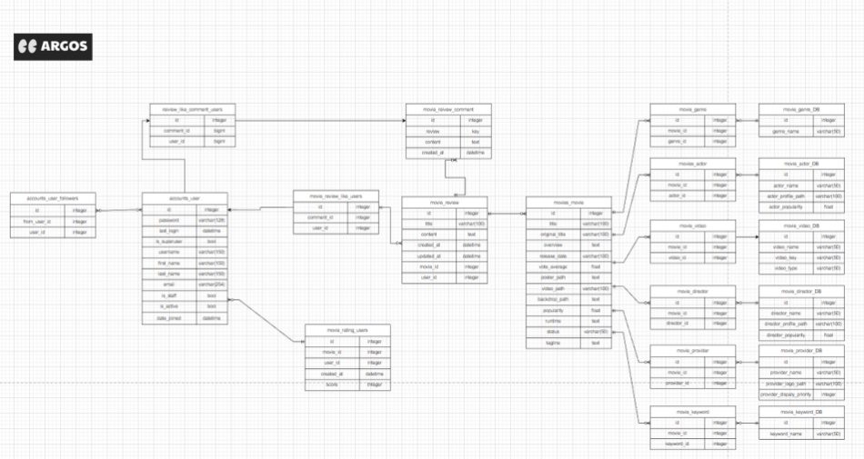
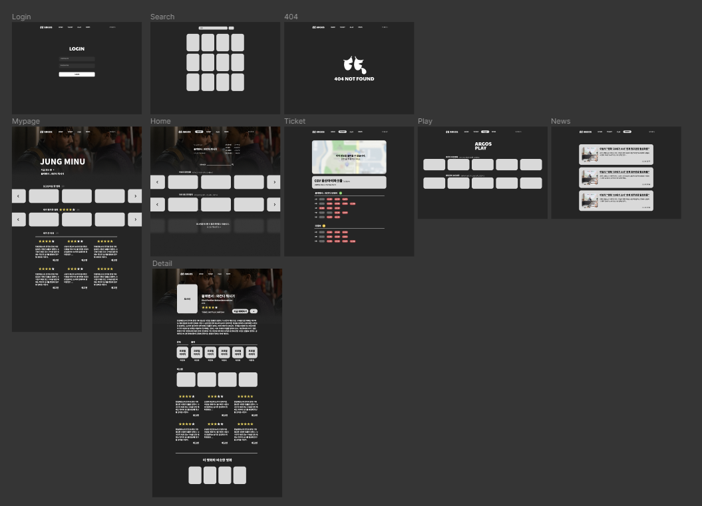
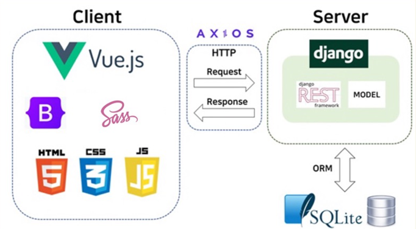
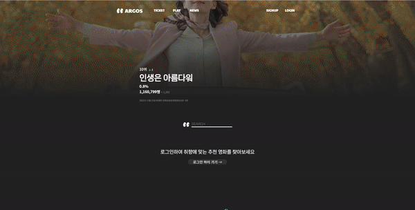
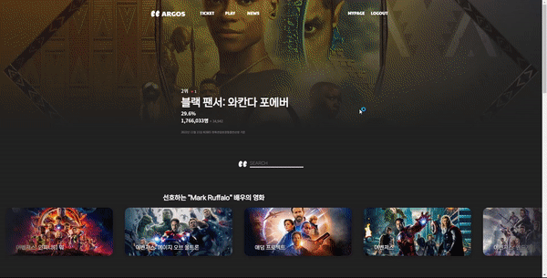
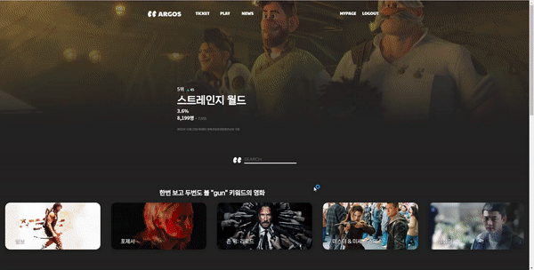
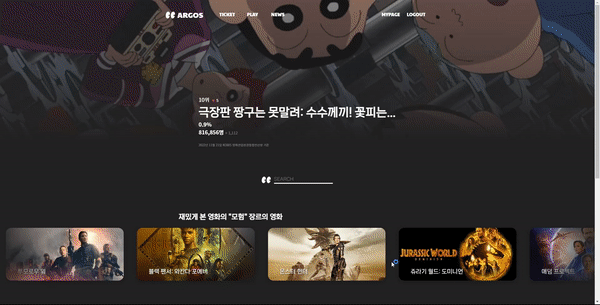

### 영화를 찾는 눈.

## 소개

- 아르고스는 그리스 로마 신화에서 100개의 눈이 달린 헤라 심복으로 소개됩니다. 헤라에게 아르고스의 눈은 다른 사람을 감시하는 눈이였지만, 저희에게 아르고스는 함께 영화를 보고, 사용자가 원하는 영화를 찾아주는 멋진 눈을 가진 친구입니다.

- ARGOS안에서 영화의 모든 것을 해결 할 수 있도록 제작했습니다.
  
  영화를 보고, 찾고, 예매하고, 관련 기사를 볼 수 있을 뿐만 아니라 사용자가
  
  재밌게 보았던 영화를 토대로 선호하는 영화를 정확하게 찾아주는 사이트를
  
  만들기로 했습니다.

## 

## 프로젝트 기간

- 2022.11.16 ~ 2022.11.24 (총 8일)

## 팀원 소개

| 정민우(조장)     | 김성훈         |
|:-----------:|:-----------:|
| 사진같은거 있음 넣기 | 사진같은거 있음 넣기 |
| 뭐했는지  적기    | 뭐했는지  적기    |
|             |             |

## ERD

## 기술 스택

#### - 디자인(Figma)

#### - Frameworks & Library(vuex, Router, Cheerio, wordcloud, D3)

#### - API

- TMDB - https://developers.themoviedb.org/3

- KakaoMap - [Kakao 지도 Web API](https://apis.map.kakao.com/web/)

## 서비스 기능(되도록 상세하게)

|     | 기능                    | 기능설명                                                                                                           |
| --- | --------------------- | -------------------------------------------------------------------------------------------------------------- |
| 1   | 회원 가입                 | 토큰을 통한 유저 회원 가입, 회원 가입 시 자동 로그인, 첫 로그인 시바로 영화 추천을 위한 영화 평가 페이지로 이동                                             |
| 2   | 로그인                   | 토큰을 통한 인증 로그인 기능 구현                                                                                            |
| 3   | 비 로그인 시               | 추천 영화 페이지 가리기 구현                                                                                               |
| 4   | 로그아웃                  | isLogin을 이용해 토큰을 null 값으로 만듬                                                                                   |
| 5   | 영화 검색 기능              | 검색하고 싶은 영화를 검색하면 그영화의 소개와 더 많은 정보를 알 수있는 링크 연결                                                                 |
| 6   | 팔로우, 팔로잉              | 유저간의 팔로우 및 팔로잉 기능 구현                                                                                           |
| 7   | 마이페이지 조회              | 유저 정보, 별점을 준 영화, 별점을 기반으로 한 선호하는 키워드, 배우, 감독, 장르 통계 자료 편성,  내가 준 평점 그래프 구현, 유저의 팔로워, 팔로잉 확인, 리뷰 작성 목록 조회 기능 구현 |
| 8   | tmdb 자료 추출 및 DB화      | 1571 개 의 영화 데이터 74500개의 세부 데이터 확보                                                                              |
| 10  | 영화 별점 주기              | 내가 본 영화를 별의 개수로 평가하는 기능 구현, 많은 영화를 평가 할 수 있게 인피니티 스크롤 구현                                                       |
| 11  | 비슷한 장르의 추천 영화 조회      | 높은 별점을 준 영화를 바탕으로 장르, 키워드, 배우, 감독 등 여러 영화 추천 기능 구현                                                             |
| 12  | 단일 영화 페이지 조회          | 세부 영화 정보 표현, 트레일러 영상, 출연 배우, 감독 및 비슷한 영화 모음 기능 구현, 유저들이 작성한 리뷰들 모음 구현                                          |
| 13  | 영화 메인 페이지 조회          | 박스 오피스 순위, 추천 영화 스와이프 형식으로 구현                                                                                  |
| 14  | 무료 영화 시청할 수 있는 공간 제작  | 유튜브 고전 영화, 독립 영화 등                                                                                             |
| 15  | 404 페이지 기능            | 없는 URL로 요청시 404 page로 push 구현                                                                                  |
| 16  | 리뷰 생성/ 삭제             | 특정 영화의 리뷰 생성 기능 및 삭제 구현                                                                                        |
| 17  | 다른 유저의 리뷰에 대댓글 생성/ 삭제 | 특정 리뷰의 댓글 생성 기능 및 삭제 구현                                                                                        |
| 18  | 영화관 시간표 조회 및 예매 링크 연결 | 위치기반 조회(지도 API, 예매시간표 ), 선택 상영관 조회(전국 영화관 DB)                                                                  |
| 19  | 영화 관련 추천 기사           | 실시간으로 영화와 관련된 기사들을 볼 수 있는 공간 구현(웹 크롤링)                                                                         |

## 영상 소개( 주요 코드 추가해서 적기)

### 도입페이지

### 

### 회원가입

### 로그아웃, 로그인과 영화 평가

### 리뷰, 코멘트

### 마이페이지

### 

### 팔로우, 팔로잉

### 

### 박스오피스

### 검색 기능

### 영화관 검색, 지도

### 독립 영화

### 영화 관련 기사 소개

## 

## 느낀점

### 정민우

### 김성훈